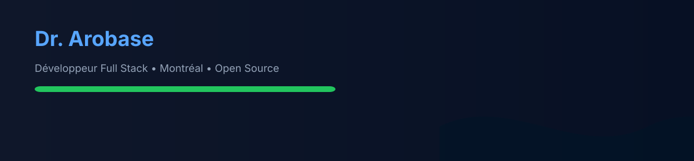
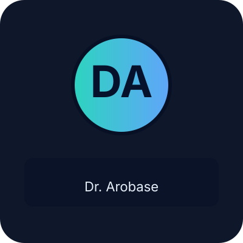
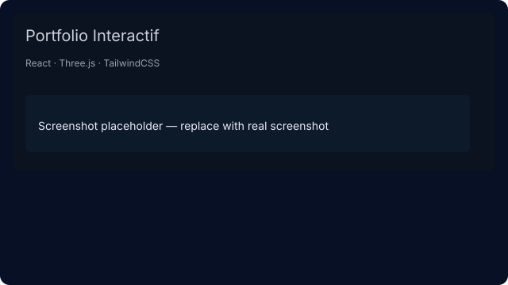
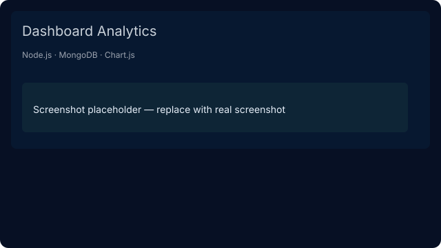

# 👋 Salut — je suis Dr. Arobase

<table>
<tr>
<td width="260" valign="top">

**Dr. Arobase**  · Développeur Full Stack

📍 Montréal, QC  ·  ☕ Café & lo‑fi

</td>

<td valign="top">

## 👨‍💻 À propos

- Étudiant au Collège de Maisonneuve
- Rôle : Développeur Full Stack — JS / Python / DevOps
- Intérêts : IA, visualisations, applications web, OSS
- Ouvert aux collaborations — contacte-moi !

</td>
</tr>
</table>

---

## 🛠️ Tech & outils

---

## 🔭 Projets épinglés

<table width="100%">
  <tr>
    <td align="center" width="50%">
      
       
      <strong>Portfolio Interactif</strong>
       React · Three.js · Tailwind
    </td>
    <td align="center" width="50%">
      
       
      <strong>Dashboard Analytics</strong>
       Node.js · MongoDB · Chart.js
    </td>
  </tr>
</table>

---

## 📊 GitHub Stats

---

## 🚀 Activité & snake

<picture>
  <source media="(prefers-color-scheme: dark)" srcset="https://raw.githubusercontent.com/dr-arobase/dr-arobase/output/github-contribution-grid-snake-dark.svg">
  
</picture>

---

## 📫 Contact

- GitHub: [dr-arobase](https://github.com/dr-arobase)
- LinkedIn: https://linkedin.com/in/dr-arobase
- Email: votre@email.com

---

Fait avec ❤️  •  Star si tu aimes mes projets ⭐

